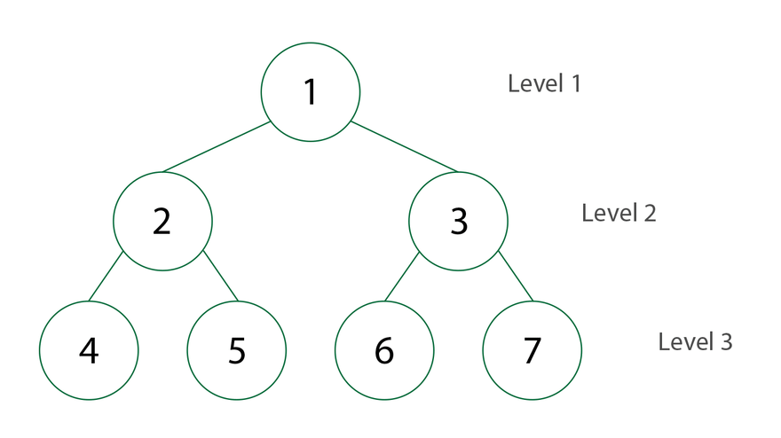
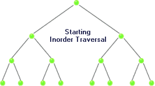

### Binary Search Tree 


### Hi there, I'm Khaleel aka Magnificvs (Magnificus) 👋
## I'm a Developer, Mystic and Dreamer

- 🔭 This repo will have LeetCode Solutions
- 🥅 Feel free to use but UNDERSTAND what the code does
- ⚡ JAVASCRIPT Code only

### Languages and Tools:

<br />


### Modified from GEEKS FOR GEEKS Brilliant Explanation:

[Click Here for Original GEEKS FOR GEEKS Article](https://www.geeksforgeeks.org/dfs-traversal-of-a-tree-using-recursion/#:~:text=DFS%20(Depth%2Dfirst%20search),sibling%20of%20that%20node%20exist.) <br />


### ⚡⚡⚡HOW TO USE ⚡⚡⚡
  
```javascript

//tested using https://repl.it/languages/javascript 

var BST = new BinarySearchTree(); 

//Insert Nodes into BST
BST.insert(15); 
BST.insert(25); 
BST.insert(10); 
BST.insert(7); 
BST.insert(22); 
BST.insert(17); 
BST.insert(13); 
BST.insert(5); 
BST.insert(9); 
BST.insert(27); 

//Get Root node
var root = BST.getRootNode(); 

//Prints OBJECT with nodes to console
console.log(root); 

//Shows Order of Node Traversal
console.log("BFS");
BST.printLevelOrder(root);//BFS recursive
console.log("DFS-Inorder");
BST.inorder(root); //DFS recursive
console.log("DFS-Preorder");
BST.preorder(root); //DFS recursive
console.log("DFS-Postorder");
BST.postorder(root); //DFS recursive

```

### ⚡⚡⚡VISUALIZATION⚡⚡⚡

## 🔧Breadth First Search🔧
<br />
[via MEDIUM](https://medium.com/@avinash.sarguru/breadth-first-search-in-a-binary-tree-405515e65416) <br />

## 🔧Depth First Search - InOrder🔧
<br />
[via SITE](http://ceadserv1.nku.edu/longa/classes/mat385_resources/docs/traversal.htm) <br />

## 🔧Depth First Search - PreOrder🔧
<br />
[via SITE](http://ceadserv1.nku.edu/longa/classes/mat385_resources/docs/traversal.htm) <br />

## 🔧Depth First Search - PostOrder🔧
<br />
[via SITE](http://ceadserv1.nku.edu/longa/classes/mat385_resources/docs/traversal.htm) <br />

